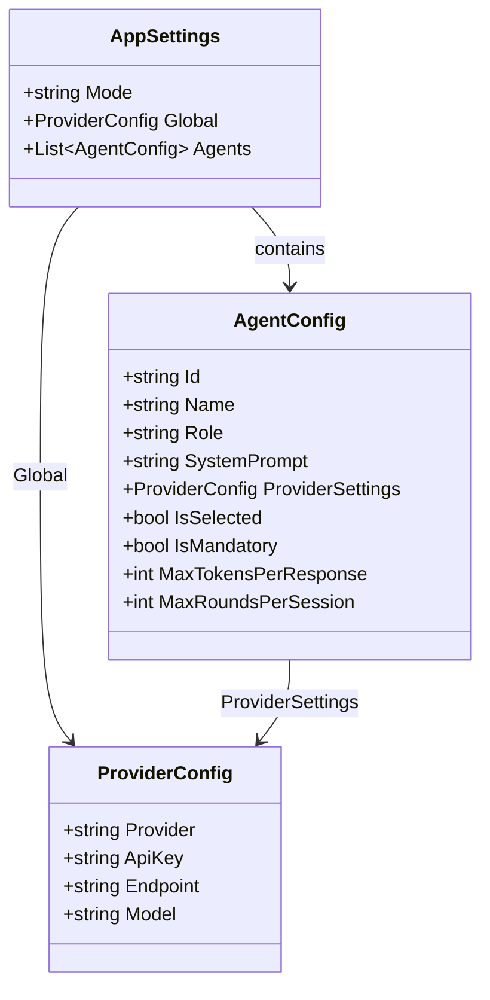
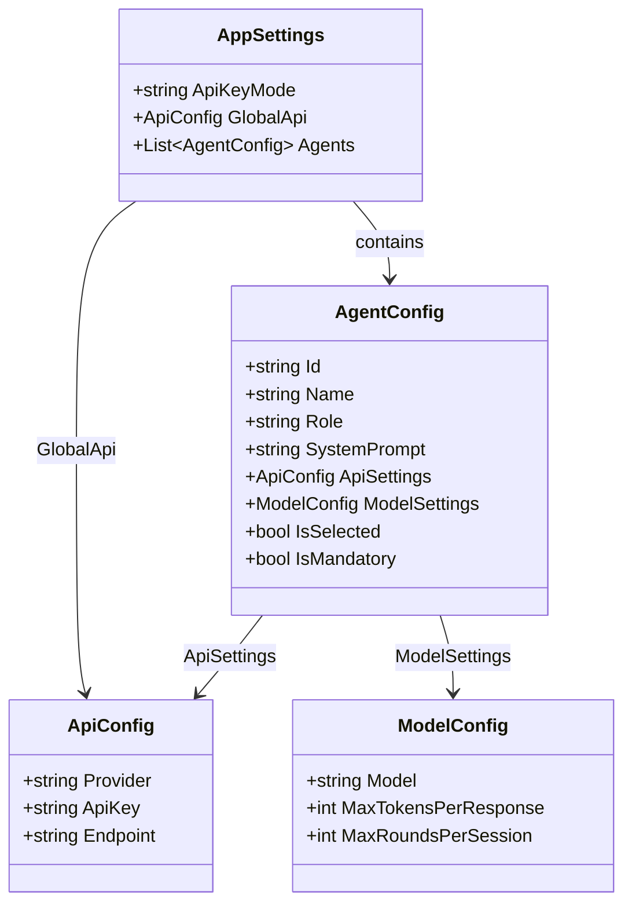
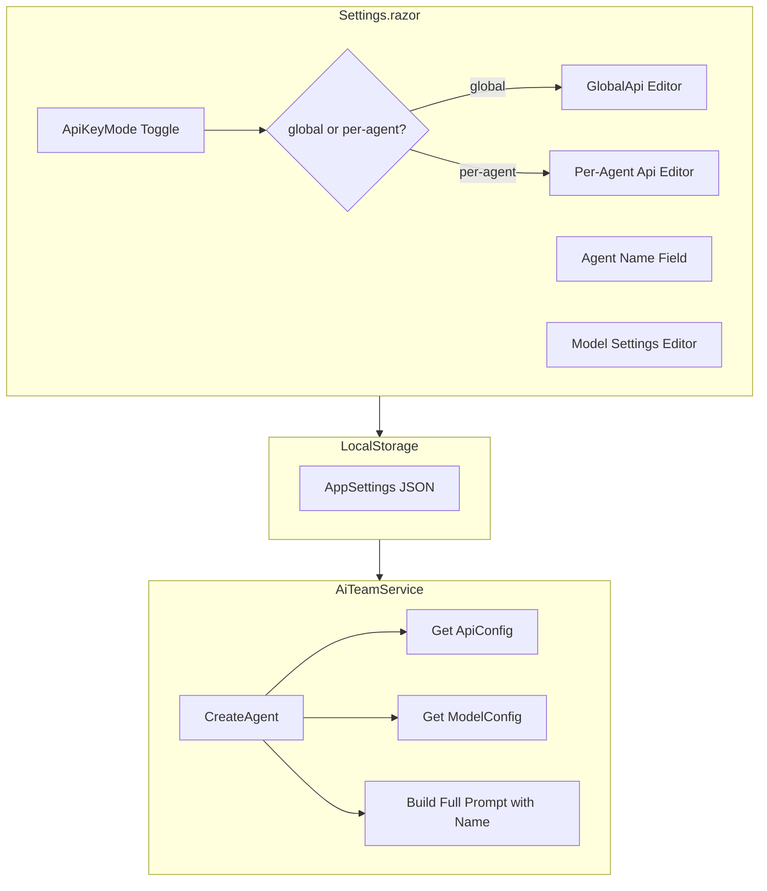

# План: Имена агентов и независимые настройки API

## Обзор задачи

1. **Имена агентов в системном промпте** - имя агента автоматически добавляется в начало системного промпта
2. **Редактируемое имя агента** - пользователь может изменить имя агента в настройках
3. **Независимые настройки API** - API ключ может быть глобальным или per-agent, а модель/токены всегда per-agent

## Текущая архитектура



## Предлагаемая архитектура



## Изменения в файлах

### 1. Shared/AppSettings.cs

**Изменения:**
- Переименовать `Mode` в `ApiKeyMode` для ясности
- Заменить `Global` типа `ProviderConfig` на `GlobalApi` типа `ApiConfig`
- Создать новый класс `ApiConfig` - только Provider, ApiKey, Endpoint
- Создать новый класс `ModelConfig` - Model, MaxTokensPerResponse, MaxRoundsPerSession

```csharp
public class AppSettings
{
    public string ApiKeyMode { get; set; } = "global"; // global | per-agent
    public ApiConfig GlobalApi { get; set; } = new();
    public List<AgentConfig> Agents { get; set; } = new();
}

public class ApiConfig
{
    public string Provider { get; set; } = "OpenAI";
    public string ApiKey { get; set; } = "";
    public string Endpoint { get; set; } = "";
}

public class ModelConfig
{
    public string Model { get; set; } = "";
    public int MaxTokensPerResponse { get; set; } = 1000;
    public int MaxRoundsPerSession { get; set; } = 3;
}
```

### 2. Shared/AgentConfig.cs

**Изменения:**
- Заменить `ProviderSettings` на `ApiSettings` и `ModelSettings`
- Удалить `MaxTokensPerResponse` и `MaxRoundsPerSession` - они переносятся в `ModelConfig`

```csharp
public class AgentConfig
{
    public string Id { get; set; } = Guid.NewGuid().ToString();
    public string Name { get; set; } = "";
    public string Role { get; set; } = "";
    public string SystemPrompt { get; set; } = "";
    public ApiConfig? ApiSettings { get; set; }  // null если используется GlobalApi
    public ModelConfig ModelSettings { get; set; } = new();
    public bool IsSelected { get; set; } = true;
    public bool IsMandatory { get; set; } = false;
}
```

### 3. Services/SettingsService.cs

**Изменения:**
- Обновить `GetDefaultAgents()` для использования новой структуры
- Добавить миграцию старых настроек при загрузке

### 4. Pages/Settings.razor

**Изменения:**
- Добавить секцию редактирования имени агента
- Разделить UI на три части:
  1. Глобальные настройки API (Provider, ApiKey, Endpoint)
  2. Переключатель ApiKeyMode (global/per-agent)
  3. Настройки каждого агента:
     - Имя (редактируемое поле)
     - API настройки (если ApiKeyMode = per-agent)
     - Настройки модели (Model, MaxTokens, MaxRounds)

### 5. Components/ProviderSettingsEditor.razor

**Изменения:**
- Разделить на два компонента или добавить параметр для скрытия модели:
  - `ApiSettingsEditor` - только Provider, ApiKey, Endpoint
  - `ModelSettingsEditor` - Model, MaxTokens, MaxRounds

### 6. Api/Services/AiTeamService.cs

**Изменения:**
- Метод `CreateAgent()` должен:
  1. Получить ApiConfig из `appSettings.GlobalApi` или `agentConfig.ApiSettings`
  2. Получить ModelConfig из `agentConfig.ModelSettings`
  3. Добавить имя агента в начало SystemPrompt

```csharp
public ChatCompletionAgent CreateAgent(AgentConfig agentConfig, AppSettings appSettings)
{
    // Получаем API конфигурацию
    ApiConfig apiConfig = appSettings.ApiKeyMode == "global" 
        ? appSettings.GlobalApi 
        : agentConfig.ApiSettings ?? appSettings.GlobalApi;
    
    // Создаем ProviderConfig для совместимости с CreateChatService
    var providerConfig = new ProviderConfig
    {
        Provider = apiConfig.Provider,
        ApiKey = apiConfig.ApiKey,
        Endpoint = apiConfig.Endpoint,
        Model = agentConfig.ModelSettings.Model
    };
    
    var chatService = CreateChatService(providerConfig);
    // ... остальной код
    
    // Добавляем имя в промпт
    var fullPrompt = $"Your name is {agentConfig.Name}. {agentConfig.SystemPrompt}";
    
    var agent = new ChatCompletionAgent
    {
        Kernel = kernel,
        Name = agentConfig.Name,
        Instructions = fullPrompt,
        // ...
    };
}
```

### 7. Api/Controllers/AiTeamController.cs

**Изменения:**
- Обновить логику получения API конфигурации для Clarification Agent

## Диаграмма потока данных



## UI Mockup

```
┌─────────────────────────────────────────────────────────────┐
│ Settings                                                     │
├─────────────────────────────────────────────────────────────┤
│                                                              │
│ ┌─────────────────────────────────────────────────────────┐ │
│ │ API Key Settings                                         │ │
│ │ ┌─────────────────────────────────────────────────────┐ │ │
│ │ │ ○ Global API Key    ● Per-Agent API Key            │ │ │
│ │ └─────────────────────────────────────────────────────┘ │ │
│ │                                                          │ │
│ │ [Global API Settings - shown when Global selected]      │ │
│ │ Provider: [OpenAI ▼]                                    │ │
│ │ API Key:  [••••••••••••]                                │ │
│ │ Endpoint: [                    ] (only for Azure)       │ │
│ └─────────────────────────────────────────────────────────┘ │
│                                                              │
│ ┌─────────────────────────────────────────────────────────┐ │
│ │ Agent: Project Manager                    [Mandatory]   │ │
│ │ ─────────────────────────────────────────────────────── │ │
│ │ Name: [Project Manager        ]                         │ │
│ │                                                          │ │
│ │ [API Settings - shown when Per-Agent selected]          │ │
│ │ Provider: [OpenAI ▼]                                    │ │
│ │ API Key:  [••••••••••••]                                │ │
│ │                                                          │ │
│ │ Model Settings:                                          │ │
│ │ Model:      [gpt-4 ▼]                                   │ │
│ │ Max Tokens: [1000  ]                                     │ │
│ │ Max Rounds: [3     ]                                     │ │
│ └─────────────────────────────────────────────────────────┘ │
│                                                              │
│ ┌─────────────────────────────────────────────────────────┐ │
│ │ Agent: Product Owner                                     │ │
│ │ ─────────────────────────────────────────────────────── │ │
│ │ Name: [Product Owner          ]                         │ │
│ │ ... (similar structure)                                  │ │
│ └─────────────────────────────────────────────────────────┘ │
│                                                              │
│ [Save Settings]                                              │
└─────────────────────────────────────────────────────────────┘
```

## Обратная совместимость

Для обеспечения миграции существующих настроек:

```csharp
public async Task<AppSettings> LoadSettingsAsync()
{
    var settings = await _localStorage.GetItemAsync<AppSettings>(SettingsKey);
    
    if (settings != null)
    {
        // Миграция старого формата
        if (settings.Mode != null && settings.ApiKeyMode == null)
        {
            settings.ApiKeyMode = settings.Mode;
            settings.Mode = null;
        }
        
        // Миграция Global -> GlobalApi
        if (settings.Global != null && settings.GlobalApi == null)
        {
            settings.GlobalApi = new ApiConfig
            {
                Provider = settings.Global.Provider,
                ApiKey = settings.Global.ApiKey,
                Endpoint = settings.Global.Endpoint
            };
        }
        
        // Миграция AgentConfig
        foreach (var agent in settings.Agents)
        {
            if (agent.ProviderSettings != null && agent.ApiSettings == null)
            {
                agent.ApiSettings = new ApiConfig
                {
                    Provider = agent.ProviderSettings.Provider,
                    ApiKey = agent.ProviderSettings.ApiKey,
                    Endpoint = agent.ProviderSettings.Endpoint
                };
            }
            
            if (agent.ModelSettings == null)
            {
                agent.ModelSettings = new ModelConfig
                {
                    Model = agent.ProviderSettings?.Model ?? "",
                    MaxTokensPerResponse = agent.MaxTokensPerResponse,
                    MaxRoundsPerSession = agent.MaxRoundsPerSession
                };
            }
        }
    }
    
    return settings;
}
```

## Порядок реализации

1. **Модели данных** - обновить AppSettings.cs и AgentConfig.cs
2. **SettingsService** - добавить миграцию и обновить GetDefaultAgents()
3. **UI компоненты** - создать/обновить компоненты редактирования
4. **API сервисы** - обновить AiTeamService.cs
5. **Контроллер** - обновить AiTeamController.cs
6. **Тестирование** - проверить все сценарии

## Риски и вопросы

1. **Миграция данных** - существующие настройки пользователей должны корректно мигрировать
2. **Валидация** - при per-agent режиме нужно проверять, что у каждого выбранного агента есть API настройки
3. **UX** - нужно продумать, как показывать ошибки валидации пользователю
